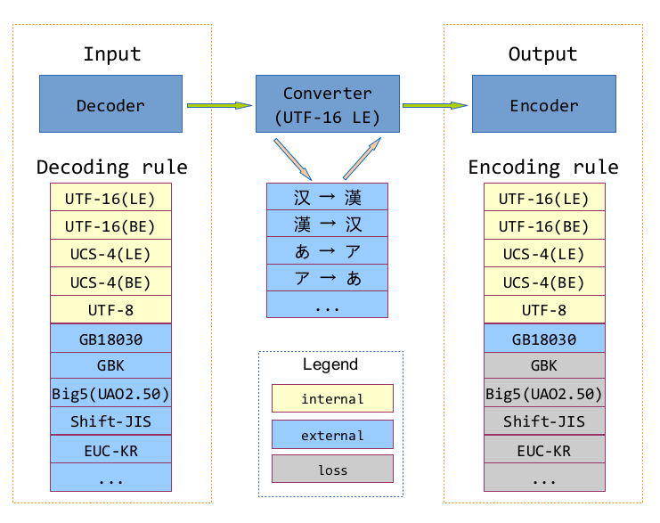

# nextc4.js
A pure JavaScript library of Character Sets encoding/decoding. The basic concepts are coming from [C4](https://github.com/kuyur/c4), [NextC4](https://github.com/kuyur/next-c4) and [Unicue](https://github.com/kuyur/unicue) projects.

# Development

## Checkout source code

    git clone https://github.com/kuyur/nextc4js.git

## Preparation

    npm install
    npm install -g rollup

## Generate charmap physical files

Execute:

```bash
# generate cp932 (shift-jis)  to unicode charmap
node ./tools/generate-charmap-generic.js -i ./charmaps/source/front/cp932-1.txt -o ./charmaps/temp/cp932-1.map
node ./tools/generate-charmap-generic.js -i ./charmaps/source/front/cp932-2.txt -o ./charmaps/temp/cp932-2.map
node ./tools/merge-charmaps.js -i1 ./charmaps/temp/cp932-1.map -i2 ./charmaps/temp/cp932-2.map -o ./charmaps/front-jis2u-little-endian.map

# generate cp936 (gbk) to unicode charmap
node ./tools/generate-charmap-generic.js -i ./charmaps/source/front/cp936-1.txt -o ./charmaps/temp/cp936-1.map
node ./tools/generate-charmap-generic.js -i ./charmaps/source/front/cp936-2.txt -o ./charmaps/temp/cp936-2.map
node ./tools/merge-charmaps.js -i1 ./charmaps/temp/cp936-1.map -i2 ./charmaps/temp/cp936-2.map -o ./charmaps/front-gbk2u-little-endian.map

# generate uao2.50 (big5) to unicode charmap
node ./tools/generate-charmap-generic.js -i ./charmaps/source/front/uao250-b2u.txt -o ./charmaps/front-b2u-little-endian.map

# generate cp949 (korean) to unicode charmap
node ./tools/generate-charmap-generic.js -i ./charmaps/source/front/cp949.txt -o ./charmaps/front-kr2u-little-endian.map

# generate cp1251 (cyrillic) to unicode charmap
node ./tools/generate-charmap-generic.js -i ./charmaps/source/front/cp1251.txt -o ./charmaps/front-cyrillic2u-little-endian.map

# generate cp1252 (latin) to unicode charmap
node ./tools/generate-charmap-generic.js -i ./charmaps/source/front/cp1252.txt -o ./charmaps/front-latin2u-little-endian.map

# generate gb18030 to unicode charmap
node ./tools/generate-gb18030-to-unicode-charmap.js -i ./charmaps/front-gbk2u-little-endian.map -o ./charmaps/front-gb180302u-little-endian.map

# generate unicode to gb18030 charmap
node ./tools/generate-unicode-to-gb18030-charmap.js -i ./charmaps/front-gb180302u-little-endian.map -o ./charmaps/back-u2gb18030-little-endian.map

# generate simplified chinese to traditional chinese charmap (basing on unicode bmp)
node ./tools/generate-medium-charmap-generic.js -i ./charmaps/source/medium/simp2tra.txt -o ./charmaps/medium-simp2tra-little-endian.map

# generate traditional chinese to simplified chinese charmap (basing on unicode bmp)
node ./tools/generate-medium-charmap-generic.js -i ./charmaps/source/medium/tra2simp.txt -o ./charmaps/medium-tra2simp-little-endian.map
```

## Generate lite or full (charmap-embedded) preset

```bash
node ./tools/generate-preset.js -i ./presets-template/context/context-default.json -o ./lib/contexts/context-default.json --embed-charmap

node ./tools/generate-preset.js -i ./presets-template/context/context-anisong.json -o ./presets-built/lite/context-anisong.json
node ./tools/generate-preset.js -i ./presets-template/context/context-chinese.json -o ./presets-built/lite/context-chinese.json
node ./tools/generate-preset.js -i ./presets-template/context/context-default.json -o ./presets-built/lite/context-default.json
node ./tools/generate-preset.js -i ./presets-template/context/context-gb18030.json -o ./presets-built/lite/context-gb18030.json

node ./tools/generate-preset.js -i ./presets-template/context/context-anisong.json -o ./presets-built/full/context-anisong.json --embed-charmap
node ./tools/generate-preset.js -i ./presets-template/context/context-chinese.json -o ./presets-built/full/context-chinese.json --embed-charmap
node ./tools/generate-preset.js -i ./presets-template/context/context-default.json -o ./presets-built/full/context-default.json --embed-charmap
node ./tools/generate-preset.js -i ./presets-template/context/context-gb18030.json -o ./presets-built/full/context-gb18030.json --embed-charmap
```

## Linting

```bash
# linting
npm run lint

# auto-fix
npm run lint:fix
```

## Test

    npm test

## Build the distributions

    npm run build

# Usage

## Use in browser

### Lite version
```html
<script src="path_to_nextc4/nextc4-lite.min.js"></script>
```

The size of lite version is only 27k and doesn't contain any external charmaps.  
```javascript
// create a Context from empty configuration (without loading external charmaps)
var context = new nextc4.Context();

// UTF-8, UTF-16LE, UTF-16BE will be available for encoding and decoding
var utf8BufferWithoutBom = new Uint8Array([
  228, 184, 128, 231, 171, 160, 227, 128, 128, 233, 129,
  160, 229, 173, 144, 229, 133, 136, 232, 188, 169, 227,
  129, 175, 227, 128, 129, 231, 190, 142, 233, 163, 159,
  229, 174, 182, 227, 129, 167, 227, 129, 153
]);

// decoded result is Uint32Array
var unicodeCodePoints = context.decode(utf8BufferWithoutBom, 'UTF-8');

// convert to string
console.log(nextc4.utils.toString(unicodeCodePoints));

// encoded results is Uint8Array (binary)
context.encode(unicodeCodePoints, 'UTF-16LE');
```

You can load a context from a URL, when the binary data of external charmaps are stored separately.  
The loading is asynchronous and returns a Promise instance.

```javascript
var promise = nextc4.loadFromUrl('https://kuyur.github.io/unicue-online/presets/context-anisong.json');
promise.then(context => {
  var shiftJisBuffer = new Uint8Array([
    136, 234, 143, 205, 129, 64, 137, 147, 142, 113, 144,
    230, 148, 121, 130, 205, 129, 65, 148, 252, 144, 72,
    137, 198, 130, 197, 130, 183
  ]);
  var unicodeCodePoints = context.decode(shiftJisBuffer, 'Shift-JIS(CP932)');
  console.log(nextc4.utils.toString(unicodeCodePoints));

  // use parse() API
  var str = context.parse(shiftJisBuffer, 'Shift-JIS(CP932)');
  console.log(str);
});
```

with async/await:
```javascript
var context = await nextc4.loadFromUrl('https://kuyur.github.io/unicue-online/presets/context-anisong.json');
...
context.decode(...);
...
context.encode(...);
...
```

You also can load from the preset with binary charmap embedded.
```javascript
var promise = nextc4.loadFromUrl('https://kuyur.github.io/unicue-online/presets-charmap-embedded/context-default.json');
promise.then(context => {
  ...
  context.decode(...);
  ...
  context.encode(...);
  ...
});
```

### Full version
You can use the full version containing some embedded charmaps. This version provides an additional `loadDefault()` method which will return a Context instance immediately.
```html
<script src="path_to_nextc4/nextc4-all.min.js"></script>
```

```javascript
var context = nextc4.loadDefault(); // singleton instance. no promise is required 
var shiftJisBuffer = new Uint8Array([
  136, 234, 143, 205, 129, 64, 137, 147, 142, 113, 144,
  230, 148, 121, 130, 205, 129, 65, 148, 252, 144, 72,
  137, 198, 130, 197, 130, 183
]);
console.log(context.parse(shiftJisBuffer, 'Shift-JIS(CP932)'));
```

The decoders below are available inside the default context:
```text
Shift-JIS(CP932)
GBK(CP936)
BIG5(UAO2.50)
EUC-KR(CP949)
Latin(CP1252)
Cyrillic(CP1251)
```

## Use in node
```bash
npm install nextc4.js
```

```javascript
const nextc4 = require('nextc4.js');

var context = nextc4.loadDefault();
var shiftJisBuffer = new Uint8Array([
  136, 234, 143, 205, 129, 64, 137, 147, 142, 113, 144,
  230, 148, 121, 130, 205, 129, 65, 148, 252, 144, 72,
  137, 198, 130, 197, 130, 183
]);
console.log(context.parse(shiftJisBuffer, 'Shift-JIS(CP932)'));
```

If you want to use other contexts, copy the charmap binary files and preset files of contexts to your project.

There are two styles.

### A. Lite preset file with separated charmap binary 
Copy the files below to your project:
```
presets-built/lite/*.json
charmaps/*.map
```

NOTE: If you want to use your customized context, follow the example under folder `presets-template/context/` and create a new one, and then execute:
```bash
node ./tools/generate-preset.js -i <input_template_path> -o <output_preset_path>
```

Then you can load a context from the preset file:
```javascript
var promise = nextc4.loadFromJson('/path/to/presets-lite/context-anisong.json');
promise.then(context => {
  ...
});
```

You also can load synchronously:
```javascript
var context = nextc4.loadFromJsonSync('path/to/presets-lite/context-anisong.json'); // no promise is required.
```

### B. Full preset file
Copy the files below to your project:
```
presets-built/full/*.json
```
Because the charmap binary is already embedded, separated charmap binary files are not required.

NOTE: If you want to use your customized context, follow the example under folder `presets-template/context/` and create a new one, and then execute:
```bash
node ./tools/generate-preset.js -i <input_template_path> -o <output_preset_path> --embed-charmap
```

You can load the context in this way: import JSON synchronously and construct:
```javascript
var myPreset = require('path/to/presets-full/context-default.json');
var nextc4 = require('nextc4.js');

var context = new nextc4.Context(myPreset);
```

# API

# Advanced Topics

## Concept and Architecture



## Generate your customized charmap
nextc4 allow customization of charmap. Let's use [CP1253.TXT](https://unicode.org/Public/MAPPINGS/VENDORS/MICSFT/WINDOWS/CP1253.TXT) as an example.  

Here is a fragment from CP1253.TXT. As you see, column #1 is the cp1253 code in hex and column #2 is the Unicode in hex. The lines are put in cp1253 order.
```text
...
0x7B	0x007B	#LEFT CURLY BRACKET
0x7C	0x007C	#VERTICAL LINE
0x7D	0x007D	#RIGHT CURLY BRACKET
0x7E	0x007E	#TILDE
0x7F	0x007F	#DELETE
0x80	0x20AC	#EURO SIGN
0x81	      	#UNDEFINED
0x82	0x201A	#SINGLE LOW-9 QUOTATION MARK
0x83	0x0192	#LATIN SMALL LETTER F WITH HOOK
0x84	0x201E	#DOUBLE LOW-9 QUOTATION MARK
0x85	0x2026	#HORIZONTAL ELLIPSIS
0x86	0x2020	#DAGGER
0x87	0x2021	#DOUBLE DAGGER
...
```
 
As `0x00~0x7F` (ASCII code) will be mapped to `U+0000~U+007F`, we can remove this range to reduce the size of generated charmap. Save the lines of `0x80~0xFF`, and name the file as `cp1253.txt`. We will use this file to generate a front charmap which will convert SBCS/DBCS/MBCS (they are called ANSI by Microsoft) to Unicdoe.
```text
0x80	0x20AC	#EURO SIGN
0x81	      	#UNDEFINED
...
0xFE	0x03CE	#GREEK SMALL LETTER OMEGA WITH TONOS
0xFF	      	#UNDEFINED
```

Run the command:
```bash
node ./tools/generate-charmap-generic.js -i ./charmaps/source/front/cp1253.txt -o ./charmaps/front-greek2u-little-endian.map
```

Generate base64-encoded data uri:
```bash
node ./tools/generate-data-uri-string.js -i ./charmaps/front-greek2u-little-endian.map
```

```
data:application/octet-stream;base64,rCD9/xogkgEeICYgICAhIP3/MCD9/zkg/f/9//3//f/9/xggGSAcIB0gIiATIBQg/f8iIf3/OiD9//3//f/9/6AAhQOGA6MApAClAKYApwCoAKkA/f+rAKwArQCuABUgsACxALIAswCEA7UAtgC3AIgDiQOKA7sAjAO9AI4DjwOQA5EDkgOTA5QDlQOWA5cDmAOZA5oDmwOcA50DngOfA6ADoQP9/6MDpAOlA6YDpwOoA6kDqgOrA6wDrQOuA68DsAOxA7IDswO0A7UDtgO3A7gDuQO6A7sDvAO9A74DvwPAA8EDwgPDA8QDxQPGA8cDyAPJA8oDywPMA80DzgP9/w==
```

Configure cp1253 charmap:
```json
  {
    "name": "Greek(CP1253)",
    "description": "Greek to Unicode.",
    "version": "Microsoft CP1253",
    "type": "decoder",
    "buffer": "data:application/octet-stream;base64,rCD9/xogkgEeICYgICAhIP3/MCD9/zkg/f/9//3//f/9/xggGSAcIB0gIiATIBQg/f8iIf3/OiD9//3//f/9/6AAhQOGA6MApAClAKYApwCoAKkA/f+rAKwArQCuABUgsACxALIAswCEA7UAtgC3AIgDiQOKA7sAjAO9AI4DjwOQA5EDkgOTA5QDlQOWA5cDmAOZA5oDmwOcA50DngOfA6ADoQP9/6MDpAOlA6YDpwOoA6kDqgOrA6wDrQOuA68DsAOxA7IDswO0A7UDtgO3A7gDuQO6A7sDvAO9A74DvwPAA8EDwgPDA8QDxQPGA8cDyAPJA8oDywPMA80DzgP9/w==",
    "byte": 2,
    "rules": [
      {
        "condition": [
          "0x00~0xFF"
        ]
      }
    ],
    "segments": [
      {
        "begin": 0,
        "end": 127,
        "reference": "ascii",
        "characterset": "ascii"
      },
      {
        "begin": 128,
        "end": 255,
        "reference": "buffer",
        "offset": 0,
        "characterset": "CP1253"
      }
    ]
  }
```

Test the charmap:
```javascript
var { DecoderMultibyte, utils } = require('nextc4.js');

var option = {
  "name": "Greek(CP1253)",
  "description": "Greek to Unicode.",
  "version": "Microsoft CP1253",
  "type": "decoder",
  "buffer": "data:application/octet-stream;base64,rCD9/xogkgEeICYgICAhIP3/MCD9/zkg/f/9//3//f/9/xggGSAcIB0gIiATIBQg/f8iIf3/OiD9//3//f/9/6AAhQOGA6MApAClAKYApwCoAKkA/f+rAKwArQCuABUgsACxALIAswCEA7UAtgC3AIgDiQOKA7sAjAO9AI4DjwOQA5EDkgOTA5QDlQOWA5cDmAOZA5oDmwOcA50DngOfA6ADoQP9/6MDpAOlA6YDpwOoA6kDqgOrA6wDrQOuA68DsAOxA7IDswO0A7UDtgO3A7gDuQO6A7sDvAO9A74DvwPAA8EDwgPDA8QDxQPGA8cDyAPJA8oDywPMA80DzgP9/w==",
  "byte": 2,
  "rules": [
    {
      "condition": [
        "0x00~0xFF"
      ]
    }
  ],
  "segments": [
    {
      "begin": 0,
      "end": 127,
      "reference": "ascii",
      "characterset": "ascii"
    },
    {
      "begin": 128,
      "end": 255,
      "reference": "buffer",
      "offset": 0,
      "characterset": "CP1253"
    }
  ]
};
var cp1253 = new DecoderMultibyte(option);

var codepoints = cp1253.decode(new Uint8Array([0x41, 0x42, 0x43, 0x80, 0xDC, 0xDD, 0xDE, 0xDF]));
console.log(utils.toString(codepoints));
```

## Performance vs Size

## Configure a customized context and embed charmaps
